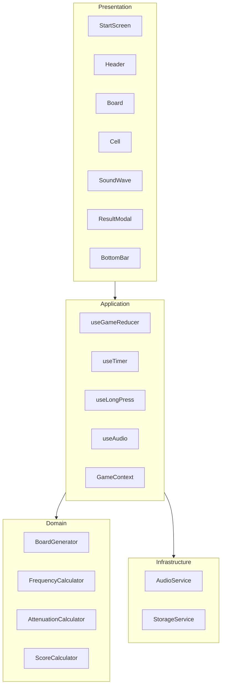
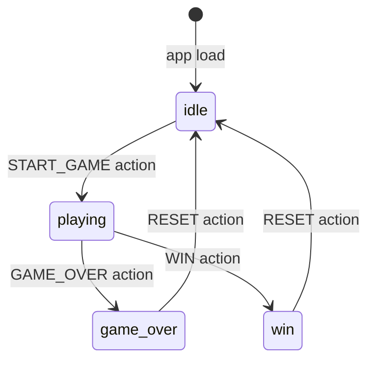
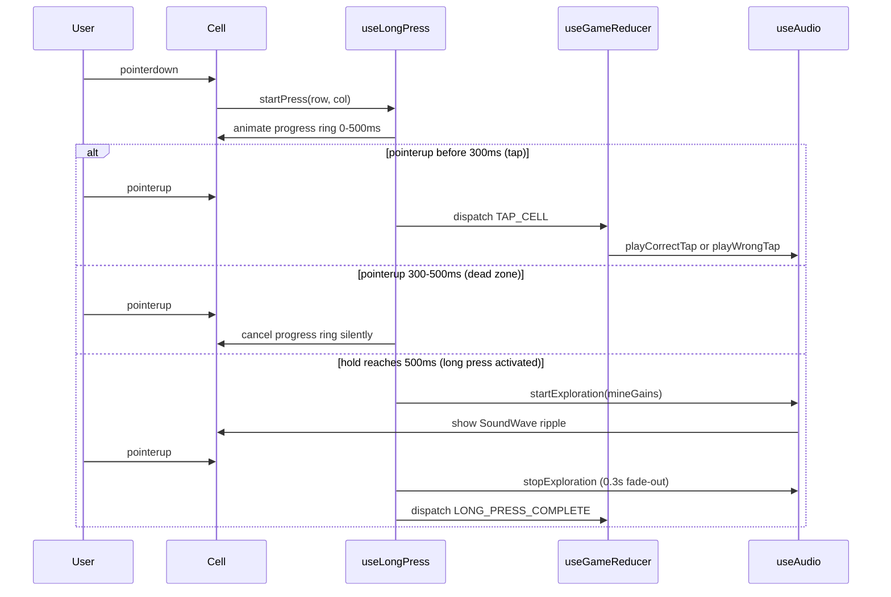
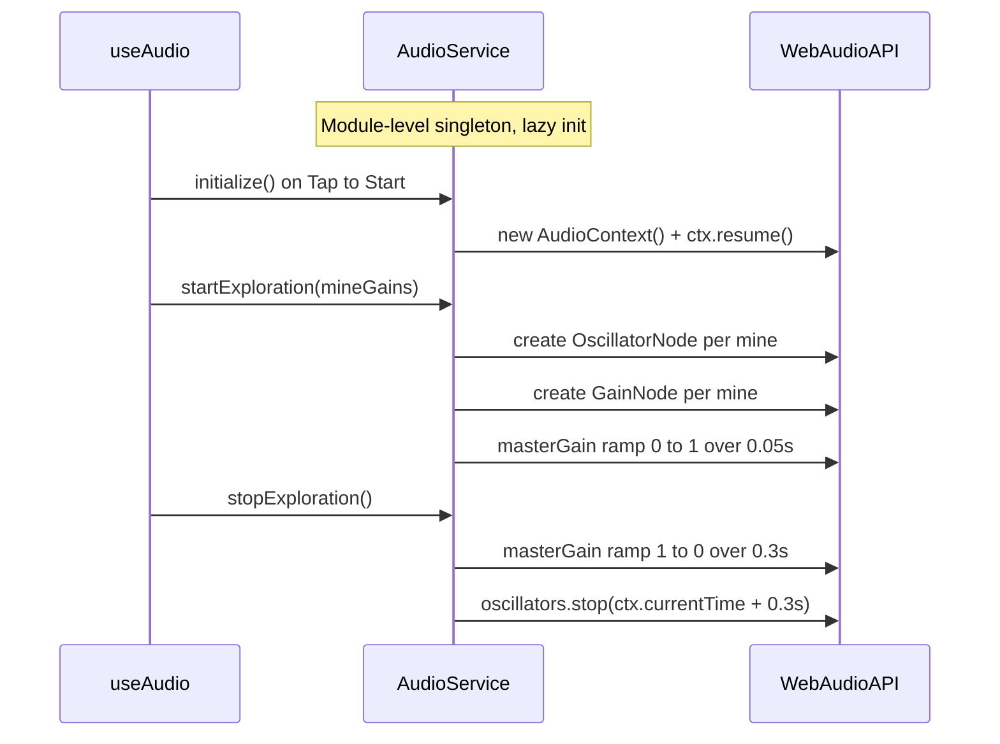

# Design Document: Sonic Minesweeper

## Overview

Sonic Minesweeper is a mobile-first, single-page web game that challenges players to locate hidden mines on a grid using audio-spatial cues. Each mine emits a unique synthesized frequency; long-pressing a cell plays the distance-attenuated blend of nearby mine sounds. Players identify mines by tapping cells — correct identification is free, wrong identification costs significant time. A real-time countdown is the sole resource, and dual game-over conditions (time exhaustion or three wrong taps) enforce strategic decisions between exploration and identification.

The system is delivered as a fully client-side React 19 + TypeScript application built with Vite. All audio synthesis uses the Web Audio API (no external audio libraries), and all game state is managed via `useReducer` + Context (no external state management libraries). Deployment targets static hosting (Vercel / GitHub Pages) with a bundle under 200 KB gzip.

This document translates 14 requirements and 60+ acceptance criteria from `requirements.md` into a four-layer Layered SPA architecture: Presentation (React components), Application (custom hooks), Domain (pure logic functions), and Infrastructure (Web Audio API singleton, localStorage abstraction). See `research.md` for investigation notes and evaluated alternatives.

### Goals

- Deliver a playable game with three difficulty levels (Beginner 8×8, Intermediate 12×12, Advanced 16×16), dual gestures (tap + long-press), real-time countdown, and full scoring in a single static bundle.
- Implement distance-attenuated spatial audio synthesis using `OscillatorNode` + `GainNode` without external libraries.
- Achieve < 50ms audio latency, 60 fps rendering on the 16×16 board, and < 200 KB gzip bundle.
- Support iOS Safari 15+, Chrome 90+, Firefox 90+, Samsung Internet 15+ across mobile and desktop.

### Non-Goals

- No backend, server-side logic, or network requests.
- No multiplayer or shared board modes.
- No PWA / offline caching (future consideration per steering).
- No custom waveform selection (future consideration per steering).
- No sound pre-learning tutorial mode (future consideration per steering).

---

## Architecture

### Architecture Pattern & Boundary Map

**Selected pattern**: Layered SPA — four horizontal layers with strict top-down dependency flow. Each layer may only import from the layer immediately below it. See `research.md §Architecture Pattern Evaluation` for rejected alternatives.



**Architecture Integration**:

- **AudioService** is a module-level singleton at the Infrastructure layer — it is never stored in React state. This satisfies the single-instance constraint (Req 14.6) and survives React lifecycle events. See `research.md §Decision: AudioService as Module-Level Singleton`.
- **GameContext** is the sole cross-cutting concern: it distributes `GameState` and `dispatch` to all Presentation components via React Context.
- **Cell** owns its transient press-progress animation state locally (`useState`) rather than in the global store, preventing 60 fps re-render storms on all 256 cells during `TICK` dispatches. See `research.md §Decision: React.memo on Cell with Local Press State`.
- **Domain layer** consists entirely of pure functions with no side effects, enabling isolated unit testing.

### Technology Stack & Alignment

| Layer | Choice / Version | Role in Feature | Notes |
|-------|-----------------|-----------------|-------|
| UI Framework | React 19 | Component rendering, game state via hooks | `useReducer` + Context; `React.memo` on Cell |
| Build Tool | Vite 5+ | Fast HMR, static bundle output | `@tailwindcss/vite` plugin for CSS processing |
| Styling | TailwindCSS v4 | Utility-first CSS, dark mode, CSS animations | `@import "tailwindcss"` + `@theme {}` in `app.css` |
| Audio | Web Audio API (native) | OscillatorNode + GainNode synthesis | No external audio libraries (Req 4.6) |
| State Management | useReducer + Context | Game state machine | No external library (Req per steering) |
| Persistence | localStorage | Top-5 high scores per difficulty, earphone flag | Via `StorageService` abstraction |
| Language | TypeScript 5+ | Full type safety across all layers | `strict: true`; no `any` types |
| Runtime | Modern browsers | Chrome 90+, Safari 15+, Firefox 90+, Samsung 15+ | Pointer Events + Web Audio API required |

---

## System Flows

### Game Lifecycle State Machine



Phase `idle` renders `StartScreen`; `playing` renders `Board` + `Header` + `BottomBar`; `game_over` and `win` render `ResultModal` overlaid on the board. All transitions are dispatched exclusively through `useGameReducer`.

### Long Press Exploration & Tap Identification Flow



**Key decisions**: The 300–500ms dead zone cancels silently to prevent accidental wrong-tap penalties. A long-press + release on a mine cell also flags it via `LONG_PRESS_COMPLETE` (Req 5.7), in addition to the tap gesture. See `research.md §Decision: Gesture Dead Zone`.

### Audio Playback Flow



---

## Requirements Traceability

| Requirement | Summary | Components | Interfaces | Flows |
|-------------|---------|------------|------------|-------|
| 1.1 | Start screen: title, description, difficulty cards, start button | StartScreen | — | Game Lifecycle |
| 1.2 | Highlight selected difficulty, show its parameters | StartScreen | `GameAction.SELECT_DIFFICULTY` | — |
| 1.3 | Create/resume AudioContext on "Tap to Start" | StartScreen, AudioService | `IAudioService.initialize()` | Audio Playback Flow |
| 1.4 | One-time earphone recommendation | StartScreen, StorageService | `IStorageService.getEarphoneShown()` | — |
| 1.5 | Three difficulty levels with defined parameters | `DifficultyConfig`, `DIFFICULTY_PRESETS` | — | — |
| 2.1 | Random mine placement, no duplicate cells | BoardGenerator | `IBoardGenerator.generate()` | — |
| 2.2 | All cells initialized to `hidden` state | BoardGenerator | `Cell.state` | — |
| 2.3 | Frequency formula `220 × 2^(i/mineCount × 3)` | FrequencyCalculator | `IFrequencyCalculator.assign()` | — |
| 2.4 | Frequency array shuffled before mine assignment | FrequencyCalculator | — | — |
| 2.5 | Minimum 5.9% semitone separation guaranteed | FrequencyCalculator | — | — |
| 3.1 | Euclidean distance `√((x1−x2)²+(y1−y2)²)` | AttenuationCalculator | `IAttenuationCalculator.compute()` | Audio Playback Flow |
| 3.2 | Attenuation formula `0.3 × (1 − d/r)²` | AttenuationCalculator | — | — |
| 3.3 | One OscillatorNode per in-range mine | AudioService | `IAudioService.startExploration()` | Audio Playback Flow |
| 3.4 | 0.05s fade-in on long-press begin | AudioService | — | — |
| 3.5 | 0.3s fade-out on long-press end | AudioService | — | — |
| 3.6 | No sound + "No mines in range" indicator | Cell, Board | — | — |
| 3.7 | maxGain 0.3 per oscillator; combined ≤ 1.0 | AttenuationCalculator, AudioService | — | — |
| 4.1 | "Ding-dong-dang" on correct tap | AudioService | `IAudioService.playCorrectTap()` | — |
| 4.2 | Buzz/wrong sound on incorrect tap | AudioService | `IAudioService.playWrongTap()` | — |
| 4.3 | Explosion sound (~2s) on game over | AudioService | `IAudioService.playGameOver()` | — |
| 4.4 | Victory fanfare (all-frequency chord ~1s) on win | AudioService | `IAudioService.playVictory()` | — |
| 4.5 | Blink time progress bar at ≤ 5s | Header | — | — |
| 4.6 | All sounds via Web Audio API only | AudioService | — | — |
| 5.1 | Long-press audio begins after 500ms hold | useLongPress | `UseLongPressOptions.onLongPressActivate` | Long Press Flow |
| 5.2 | Progress ring fills over 500ms | Cell | — | — |
| 5.3 | Ripple wave animation during audio | SoundWave | `SoundWaveProps` | — |
| 5.4 | Volume → ripple color saturation | SoundWave | `SoundWaveProps.volumeLevel` | — |
| 5.5 | Deduct listen cost on long-press complete | useGameReducer | `GameAction.LONG_PRESS_COMPLETE` | Long Press Flow |
| 5.6 | Stop exploration sound on release (0.3s fade) | useAudio | `IAudioService.stopExploration()` | Long Press Flow |
| 5.7 | Long-press + release on mine → flagged | useGameReducer | `GameAction.LONG_PRESS_COMPLETE` | Long Press Flow |
| 6.1 | Tap mine cell → flagged + pulse animation | Cell, useGameReducer | `GameAction.TAP_CELL` | Long Press Flow |
| 6.2 | Tap non-mine → red × + shake + time deduction | Cell, useGameReducer | — | — |
| 6.3 | Wrong tap increments counter, flashes heart | Header, useGameReducer | — | — |
| 6.4 | Wrong count = 3 → game over | useGameReducer | `GameAction.GAME_OVER` | Game Lifecycle |
| 6.5 | Correct tap: no time deduction | useGameReducer | — | — |
| 6.6 | Flagged cells ignore all interactions | Cell | `CellProps.disabled` | — |
| 7.1 | Timer initialized at difficulty budget; decrements via rAF | useTimer | `useTimer` | — |
| 7.2 | Decrement by deltaTime per frame (±16ms) | useTimer | — | — |
| 7.3 | Display remaining time to 1 decimal | Header | `GameState.remainingTime` | — |
| 7.4 | Timer red + blinking at ≤ 10s | Header | — | — |
| 7.5 | Floating "-Xs" text on time-cost action | Header | `GameState.pendingTimePenalty` | — |
| 7.6 | Time reaches 0 → game over | useGameReducer | `GameAction.GAME_OVER` | Game Lifecycle |
| 8.1 | Halt all gameplay input on game over | useGameReducer, Cell | `GameState.phase` | — |
| 8.2 | Sequential mine reveal at 0.1s intervals | ResultModal, Board | — | — |
| 8.3 | Arpeggio of mine frequencies during reveal | AudioService | `IAudioService.playGameOver()` | — |
| 8.4 | Board dimming overlay | Board | — | — |
| 8.5 | Result modal: cause, 50% score, retry options | ResultModal | `ScoreBreakdown` | — |
| 8.6 | Wrong-tap cells highlighted with red × in game over | Cell | — | — |
| 9.1 | Last mine flagged (no wrong count ≥ 3, time > 0) → win | useGameReducer | `GameAction.WIN` | Game Lifecycle |
| 9.2 | Victory fanfare on win | AudioService | `IAudioService.playVictory()` | — |
| 9.3 | CSS confetti animation on win | ResultModal | — | — |
| 9.4 | Result modal: full score breakdown on win | ResultModal | `ScoreBreakdown` | — |
| 9.5 | High score highlight if new best | ResultModal, StorageService | `IStorageService.saveHighScore()` | — |
| 10.1 | +200 base points per correct identification | ScoreCalculator, useGameReducer | `IScoreCalculator.computeWin()` | — |
| 10.2 | −100 points per wrong tap | ScoreCalculator | — | — |
| 10.3 | Time bonus: `remainingTime × 10` | ScoreCalculator | — | — |
| 10.4 | Streak bonus: `N×(N+1)/2×50` | ScoreCalculator | — | — |
| 10.5 | Wrong tap resets streak counter | useGameReducer | `GameAction.TAP_CELL` | — |
| 10.6 | Game over → 50% base score, no bonuses | ScoreCalculator | `IScoreCalculator.computeGameOver()` | — |
| 10.7 | Top 5 high scores per difficulty in localStorage | StorageService | `IStorageService.getHighScores()` | — |
| 10.8 | Current score in header, updated in real-time | Header | `GameState.baseScore`, `GameState.wrongDeduction` | — |
| 11.1 | Fixed header: time, hearts, score, mine progress | Header | `HeaderProps` | — |
| 11.2 | Animated speaker icon during audio playback | Header | `GameState.isAudioPlaying` | — |
| 11.3 | Flagged cell: mine icon + green checkmark + pulse | Cell | `CellProps` | — |
| 11.4 | Wrong cell: red × + shake animation | Cell | — | — |
| 11.5 | No-mines: detection-radius overlay + tooltip | Board | — | — |
| 11.6 | Bottom bar: New Game + Change Difficulty | BottomBar | — | — |
| 12.1 | Minimum 44×44px touch targets | Cell | — | — |
| 12.2 | Beginner board fills screen width | Board | — | — |
| 12.3 | Intermediate: horizontal fit, minimal vertical scroll | Board | — | — |
| 12.4 | Advanced: pinch-to-zoom + pan via CSS transform | Board | — | — |
| 12.5 | Prevent default browser touch behaviors | Cell, Board | — | — |
| 12.6 | Tap/long-press mutually exclusive, no double-fire | useLongPress | — | Long Press Flow |
| 13.1 | Visual-assist: adjacent mine count on cells | Cell | `CellProps.adjacentMineCount` | — |
| 13.2 | Visual-assist: sound intensity as color gradient | Cell, SoundWave | `CellProps.visualAssist` | — |
| 13.3 | Keyboard navigation: arrows, Enter, Space | Cell, Board | — | — |
| 13.4 | Dark mode via `prefers-color-scheme` | `app.css`, TailwindCSS v4 | — | — |
| 14.1 | Bundle < 200 KB gzip | Vite build config | — | — |
| 14.2 | Audio starts within 50ms of interaction | AudioService, useLongPress | — | — |
| 14.3 | 60 fps on 16×16 board | Cell (`React.memo`), useTimer | — | — |
| 14.4 | rAF timer ±16ms accuracy | useTimer | — | — |
| 14.5 | Browser compatibility | Vite target config | — | — |
| 14.6 | Single AudioContext instance | AudioService | — | — |

---

## Components and Interfaces

### Summary

| Component | Layer | Intent | Req Coverage | Key Dependencies | Contracts |
|-----------|-------|--------|--------------|-----------------|-----------|
| AudioService | Infrastructure | Web Audio API singleton | 3.1–3.7, 4.1–4.6, 14.2, 14.6 | Web Audio API (P0) | Service |
| StorageService | Infrastructure | localStorage abstraction | 1.4, 9.5, 10.7 | localStorage (P1) | Service |
| BoardGenerator | Domain | Mine placement + cell grid init | 2.1–2.4 | FrequencyCalculator (P0) | Service |
| FrequencyCalculator | Domain | Log-scale frequency assignment | 2.3–2.5 | — | Service |
| AttenuationCalculator | Domain | Euclidean distance + gain | 3.1–3.2, 3.7 | — | Service |
| ScoreCalculator | Domain | Final score computation | 10.1–10.6 | — | Service |
| useGameReducer | Application | Central game state machine | 5.5–5.7, 6.1–6.6, 7.1, 7.6, 8.1, 9.1, 10.1–10.5 | Domain (P0) | State |
| useTimer | Application | rAF-based countdown | 7.1–7.2, 14.4 | GameContext (P0) | — |
| useLongPress | Application | Tap vs long-press gesture | 5.1, 5.5, 5.6, 12.5–12.6 | GameContext (P0) | Service |
| useAudio | Application | AudioService React integration | 3.3–3.6, 4.1–4.4, 11.2 | AudioService (P0) | Service |
| GameContext | Application | GameState + dispatch distribution | All | useGameReducer (P0) | State |
| StartScreen | Presentation | Difficulty selection + audio init | 1.1–1.5 | GameContext (P0), AudioService (P0) | — |
| Header | Presentation | Fixed status bar | 7.3–7.5, 10.8, 11.1–11.2 | GameContext (P0) | — |
| Board | Presentation | Grid container with zoom/pan | 11.5, 12.2–12.4 | GameContext (P0) | — |
| Cell | Presentation | Cell rendering + gesture capture | 5.1–5.4, 6.1–6.2, 11.3–11.4, 12.1, 12.5–12.6, 13.1–13.3 | useLongPress (P0), GameContext (P0) | State |
| SoundWave | Presentation | Ripple animation during exploration | 5.3–5.4 | — | — |
| ResultModal | Presentation | Win/lose outcome + score display | 8.2–8.5, 9.3–9.4, 9.5 | GameContext (P0), StorageService (P1) | — |
| BottomBar | Presentation | New Game / Change Difficulty | 11.6 | GameContext (P0) | — |

---

### Infrastructure Layer

#### AudioService

| Field | Detail |
|-------|--------|
| Intent | Module-level singleton managing `AudioContext` lifecycle, oscillator synthesis, and all game event sounds |
| Requirements | 3.1–3.7, 4.1–4.6, 14.2, 14.6 |

**Responsibilities & Constraints**
- Owns the single `AudioContext` instance for the entire application lifetime (Req 14.6).
- All synthesis uses `OscillatorNode` + `GainNode` only; no external audio libraries (Req 4.6).
- Must be initialized within a user-gesture handler to satisfy iOS Safari 15+ constraint (Req 1.3).
- Per-oscillator `maxGain` is 0.3; combined gain of all superimposed oscillators must not exceed 1.0 (Req 3.7).

**Dependencies**
- External: Web Audio API (P0) — `AudioContext`, `OscillatorNode`, `GainNode`

**Contracts**: Service [x]

##### Service Interface

```typescript
interface MineGain {
  readonly frequency: number;  // Hz
  readonly gain: number;       // 0.0–0.3
}

interface IAudioService {
  initialize(): Promise<void>;
  startExploration(mineGains: ReadonlyArray<MineGain>): void;
  stopExploration(): void;
  playCorrectTap(): void;
  playWrongTap(): void;
  playGameOver(frequencies: ReadonlyArray<number>): void;
  playVictory(frequencies: ReadonlyArray<number>): void;
  playUrgentBeep(): void;
  isPlaying(): boolean;
  readonly audioSupported: boolean;
  dispose(): void;
}
```

- **Preconditions**: `initialize()` must complete before any playback method is called.
- **Postconditions**: `startExploration()` creates one `OscillatorNode` + `GainNode` per entry in `mineGains`, routed through a master `GainNode` to `ctx.destination`. Master gain ramps from 0 to 1 over 0.05s.
- **Invariants**: `AudioContext` transitions: `suspended → running → (never closed during session)`. Single instance per module lifetime.

**Implementation Notes**
- Lazy initialization: `AudioContext` created on the first `initialize()` call; subsequent calls are no-ops.
- `stopExploration()` schedules `masterGain.gain.linearRampToValueAtTime(0, ctx.currentTime + 0.3)` then `oscillator.stop(ctx.currentTime + 0.3)` for each active oscillator.
- `playGameOver(frequencies)` plays each frequency as a sequential arpeggio: oscillators started at `ctx.currentTime + (i × 0.1)` seconds, each lasting 0.08s.
- `playVictory(frequencies)` starts all oscillators simultaneously for ~1s, then fades out.
- Risks: iOS Safari 15 may require a second `resume()` call after visibility change; wrap all playback in a guard that calls `ctx.resume()` if `ctx.state !== 'running'`.

---

#### StorageService

| Field | Detail |
|-------|--------|
| Intent | localStorage abstraction for high score persistence and one-time flag storage |
| Requirements | 1.4, 9.5, 10.7 |

**Contracts**: Service [x]

##### Service Interface

```typescript
interface HighScore {
  readonly score: number;
  readonly date: string;      // ISO 8601
  readonly difficulty: Difficulty;
}

interface IStorageService {
  getHighScores(difficulty: Difficulty): ReadonlyArray<HighScore>;
  saveHighScore(difficulty: Difficulty, entry: HighScore): ReadonlyArray<HighScore>;
  getEarphoneShown(): boolean;
  setEarphoneShown(): void;
}
```

- **Postconditions**: `saveHighScore` inserts entry, sorts by score descending, trims to top 5, persists, and returns updated array.
- **Invariants**: All methods are safe to call when localStorage is unavailable (private browsing, quota exceeded).

**Implementation Notes**
- Storage key pattern: `sonic-minesweeper-scores-{difficulty}`, `sonic-minesweeper-earphone-shown`.
- All calls wrapped in try/catch; on error, `getHighScores` returns `[]`, `getEarphoneShown` returns `false`.

---

### Domain Layer

#### BoardGenerator

| Field | Detail |
|-------|--------|
| Intent | Pure function generating random mine positions and initializing the cell grid |
| Requirements | 2.1–2.4 |

**Contracts**: Service [x]

##### Service Interface

```typescript
interface BoardData {
  readonly cells: ReadonlyArray<ReadonlyArray<Cell>>;
  readonly mines: ReadonlyArray<Mine>;
}

interface IBoardGenerator {
  generate(config: DifficultyConfig): BoardData;
}
```

- **Preconditions**: `config.mineCount < config.rows × config.cols`.
- **Postconditions**: `mines.length === config.mineCount`; all mine `(row, col)` pairs are unique; all `Cell.state === 'hidden'`; frequencies assigned by `FrequencyCalculator`.
- **Invariants**: Mines and cells are cross-referenced: `cells[mine.row][mine.col].hasMine === true` and `.mineId === mine.id` for each mine.

---

#### FrequencyCalculator

| Field | Detail |
|-------|--------|
| Intent | Computes and shuffles log-scale frequency array with guaranteed minimum semitone separation |
| Requirements | 2.3–2.5 |

**Contracts**: Service [x]

##### Service Interface

```typescript
interface IFrequencyCalculator {
  assign(mineCount: number): ReadonlyArray<number>;
}
```

- **Postconditions**: Returns array of `mineCount` frequencies in range [220, 1760] Hz; Fisher-Yates shuffled; adjacent frequencies in sorted order differ by ≥ 5.9%.
- Formula: `frequency[i] = 220 × 2^(i / mineCount × 3)` for `i = 0…mineCount−1`, then shuffle. If post-shuffle separation constraint is violated, re-shuffle (bounded retry: max 10 attempts). See `research.md §Risks & Mitigations`.

---

#### AttenuationCalculator

| Field | Detail |
|-------|--------|
| Intent | Computes per-mine gain values for a pressed cell using Euclidean distance attenuation |
| Requirements | 3.1–3.2, 3.7 |

**Contracts**: Service [x]

##### Service Interface

```typescript
interface IAttenuationCalculator {
  compute(
    pressedCell: CellPosition,
    mines: ReadonlyArray<Mine>,
    detectionRadius: number
  ): ReadonlyArray<MineGain>;
}
```

- **Postconditions**: Returns only mines where `d ≤ detectionRadius`; `gain = 0.3 × (1 − d/detectionRadius)²`; empty array when no mines are in range.
- **Invariants**: All returned gain values are in range [0.0, 0.3].

---

#### ScoreCalculator

| Field | Detail |
|-------|--------|
| Intent | Computes final score breakdown for win and game-over outcomes |
| Requirements | 10.1–10.6 |

**Contracts**: Service [x]

##### Service Interface

```typescript
interface ScoreBreakdown {
  readonly baseScore: number;       // correctCount × 200
  readonly wrongDeduction: number;  // wrongCount × 100 (negative)
  readonly timeBonus: number;       // remainingTime × 10 (win only)
  readonly streakBonus: number;     // Σ N×(N+1)/2×50 (win only)
  readonly total: number;
}

interface IScoreCalculator {
  computeWin(
    correctCount: number,
    wrongCount: number,
    streakHistory: ReadonlyArray<number>,
    remainingTime: number
  ): ScoreBreakdown;
  computeGameOver(
    correctCount: number,
    wrongCount: number
  ): ScoreBreakdown;
}
```

- **Postconditions**: `computeGameOver` returns `total = floor((correctCount × 200 - wrongCount × 100) × 0.5)` with `timeBonus = 0` and `streakBonus = 0`.
- `streakBonus = Σ (N × (N+1) / 2 × 50)` for each streak length `N` in `streakHistory`.

---

### Application Layer

#### useGameReducer

| Field | Detail |
|-------|--------|
| Intent | Central game state machine using `useReducer`; manages all phase transitions, cell mutations, and score tracking |
| Requirements | 5.5–5.7, 6.1–6.6, 7.1, 7.6, 8.1, 9.1, 10.1–10.5 |

**Contracts**: State [x]

##### State Management

```typescript
type GamePhase = 'idle' | 'playing' | 'game-over' | 'win';
type GameOverReason = 'time' | 'wrong-count';
type CellState = 'hidden' | 'flagged' | 'wrong';

interface GameState {
  readonly phase: GamePhase;
  readonly difficulty: DifficultyConfig;
  readonly cells: ReadonlyArray<ReadonlyArray<Cell>>;
  readonly mines: ReadonlyArray<Mine>;
  readonly remainingTime: number;        // seconds, decimal precision
  readonly wrongCount: number;           // 0–3
  readonly baseScore: number;            // accumulated: correctCount × 200
  readonly wrongDeduction: number;       // accumulated: wrongCount × 100
  readonly streakCount: number;          // consecutive correct taps (current run)
  readonly streakHistory: ReadonlyArray<number>; // completed streak lengths
  readonly flaggedCount: number;         // correctly identified mines
  readonly gameOverReason?: GameOverReason;
  readonly isAudioPlaying: boolean;
  readonly visualAssist: boolean;
  readonly pendingTimePenalty?: number;  // seconds, for floating text in Header
}

type GameAction =
  | { type: 'START_GAME'; difficulty: DifficultyConfig; boardData: BoardData }
  | { type: 'TICK'; deltaTime: number }
  | { type: 'LONG_PRESS_COMPLETE'; row: number; col: number }
  | { type: 'TAP_CELL'; row: number; col: number }
  | { type: 'GAME_OVER'; reason: GameOverReason }
  | { type: 'WIN' }
  | { type: 'RESET' }
  | { type: 'SET_AUDIO_PLAYING'; playing: boolean }
  | { type: 'CLEAR_TIME_PENALTY' }
  | { type: 'TOGGLE_VISUAL_ASSIST' };
```

- **State model**: Immutable state object; cell mutations produce new row arrays via spread.
- **Persistence**: `phase` and cell states are transient (not persisted); high scores persisted by `StorageService` outside the reducer.
- **Concurrency strategy**: Single rAF loop for `TICK`; user interactions dispatch synchronously. No concurrent mutations.

**TICK action invariant**: Before decrementing time, check if `remainingTime - deltaTime ≤ 0`; if so, dispatch `GAME_OVER` reason `'time'` in the same reducer pass.

**TAP_CELL action invariant**: If `cell.hasMine` → set `cell.state = 'flagged'`, increment `flaggedCount`, update `streakCount`; check win. If `!cell.hasMine` → set `cell.state = 'wrong'`, increment `wrongCount`, reset `streakCount`, append current streak to `streakHistory`, deduct `wrongTapCost`; if `wrongCount >= 3` dispatch `GAME_OVER` reason `'wrong-count'`.

**LONG_PRESS_COMPLETE action invariant**: Always deduct `listenCost` from `remainingTime`; if `cell.hasMine` also flag the cell (same logic as correct `TAP_CELL`).

---

#### useTimer

| Field | Detail |
|-------|--------|
| Intent | `requestAnimationFrame`-based countdown that dispatches `TICK` actions while `phase === 'playing'` |
| Requirements | 7.1–7.2, 14.4 |

**Responsibilities & Constraints**
- Runs a rAF loop; computes `deltaTime = (currentTs - prevTs) / 1000` seconds per frame.
- Clamps `deltaTime` to max 0.1s to prevent large jumps on tab resume (see `research.md §rAF Timer Accuracy`).
- Dispatches `{ type: 'TICK', deltaTime }` via `GameContext.dispatch`.
- Cancels loop when `phase !== 'playing'` or on cleanup.

**Dependencies**
- Inbound: `GameContext.dispatch` (P0)
- Inbound: `GameContext.state.phase` (P0)

---

#### useLongPress

| Field | Detail |
|-------|--------|
| Intent | Gesture recognizer that disambiguates tap (< 300ms) from long-press (≥ 500ms) on a cell element |
| Requirements | 5.1, 5.5, 5.6, 12.5–12.6 |

**Contracts**: Service [x]

##### Service Interface

```typescript
interface LongPressHandlers {
  readonly onPointerDown: (e: React.PointerEvent) => void;
  readonly onPointerUp: (e: React.PointerEvent) => void;
  readonly onPointerLeave: (e: React.PointerEvent) => void;
  readonly onPointerCancel: (e: React.PointerEvent) => void;
}

interface UseLongPressOptions {
  readonly onTap: () => void;
  readonly onLongPressActivate: () => void;
  readonly onLongPressRelease: () => void;
  readonly disabled?: boolean;
}

function useLongPress(options: UseLongPressOptions): LongPressHandlers;
```

- **Preconditions**: `disabled = true` when `cell.state === 'flagged'` or `phase !== 'playing'`.
- **Invariants**: `onTap` and `onLongPressRelease` are mutually exclusive per press; dead zone (300–500ms) fires neither. Only the first active `pointerId` is tracked; subsequent `pointerdown` with different IDs are ignored.

**Implementation Notes**
- `onPointerDown` calls `e.preventDefault()` to suppress browser scroll during press.
- Apply CSS `touch-action: none` on the cell element (not just in JS) to eliminate tap delay.
- `onPointerLeave` and `onPointerCancel` both clean up the active press timer and hide the progress ring.

---

#### useAudio

| Field | Detail |
|-------|--------|
| Intent | React hook bridging `AudioService` singleton to component tree; synchronizes `isAudioPlaying` into `GameState` |
| Requirements | 3.3–3.6, 4.1–4.4, 11.2 |

**Contracts**: Service [x]

##### Service Interface

```typescript
interface UseAudioReturn {
  readonly startExploration: (mineGains: ReadonlyArray<MineGain>) => void;
  readonly stopExploration: () => void;
  readonly playCorrectTap: () => void;
  readonly playWrongTap: () => void;
  readonly playGameOver: (frequencies: ReadonlyArray<number>) => void;
  readonly playVictory: (frequencies: ReadonlyArray<number>) => void;
  readonly playUrgentBeep: () => void;
  readonly audioSupported: boolean;
}

function useAudio(dispatch: React.Dispatch<GameAction>): UseAudioReturn;
```

- `startExploration` also dispatches `SET_AUDIO_PLAYING(true)`; `stopExploration` dispatches `SET_AUDIO_PLAYING(false)` after the 0.3s fade.

---

### Presentation Layer

#### Cell

| Field | Detail |
|-------|--------|
| Intent | Renders a single grid cell with its visual state; captures and routes pointer gestures |
| Requirements | 5.1–5.4, 6.1–6.2, 11.3–11.4, 12.1, 12.5–12.6, 13.1–13.3 |

**Responsibilities & Constraints**
- Wrapped in `React.memo` with custom `areEqual` comparing: `cell.state`, `isExploring`, `visualAssist`, `adjacentMineCount`, and callback references (via `useCallback` at parent).
- Owns local `pressProgress: number` (0.0–1.0) animated over 500ms; this state is **not** in `GameState`.
- Minimum rendered size 44×44 px (Req 12.1).

**Contracts**: State [x] (local press state only)

```typescript
interface CellProps {
  readonly cell: Cell;
  readonly onTap: () => void;
  readonly onLongPressActivate: () => void;
  readonly onLongPressRelease: () => void;
  readonly mineGains: ReadonlyArray<MineGain> | null; // null when no exploration active
  readonly visualAssist: boolean;
  readonly adjacentMineCount: number; // 0 when visualAssist is false
  readonly disabled: boolean;
  readonly cellSizePx: number;
}
```

**Implementation Notes**
- `adjacentMineCount` computed by `Board` (not stored in `GameState`) only when `visualAssist === true`, to avoid state bloat.
- Keyboard support: `onKeyDown` maps `Enter` → `onTap`, `Space` → long-press activation via `useLongPress`.
- `SoundWave` is rendered as a child when `mineGains !== null` and exploration is active.

---

#### SoundWave

Summary-only presentation component. Renders CSS-animated concentric rings expanding outward to `detectionRadius` cell-units. `volumeLevel` (0–1) maps to CSS `filter: saturate()` on ring color (louder = more saturated). No new domain boundaries.

```typescript
interface SoundWaveProps {
  readonly detectionRadius: number; // in grid cells
  readonly volumeLevel: number;     // 0.0–1.0 normalized total gain
  readonly cellSizePx: number;
}
```

---

#### Header

Summary-only. Renders `remainingTime` (1 decimal, red + blinking at ≤ 10s, blink progress bar at ≤ 5s), life hearts (3 max, flash on wrong tap), current display score (`baseScore - wrongDeduction`), mine progress counter (`🎯 flaggedCount/mineCount`), animated speaker icon (`isAudioPlaying`), and floating `pendingTimePenalty` text. Reads from `GameContext`. No new domain boundaries.

---

#### Board

Summary-only. Renders the cell grid using CSS Grid. For Advanced difficulty (16×16): applies CSS `transform: scale(zoom) translate(panX, panY)` for pinch-to-zoom + pan (Req 12.4). Container uses `touch-action: none` (Req 12.5). Renders semi-transparent radius overlay and "No mines in range" tooltip when last exploration returned empty `MineGain[]` (Reqs 3.6, 11.5). Computes `adjacentMineCount` for each cell when `visualAssist` is enabled.

---

#### StartScreen

Summary-only. Renders game title, description, three difficulty cards (each showing board size, mine count, time budget, detection radius, listen cost, wrong-tap cost), earphone recommendation (one-time, via `StorageService.getEarphoneShown()`), and "Tap to Start" button. Button `onClick` calls `AudioService.initialize()` then dispatches `START_GAME` with selected `DifficultyConfig` and board data from `BoardGenerator.generate()`.

---

#### ResultModal

Summary-only. Renders win/game-over state, `ScoreBreakdown` detail rows (base, time bonus, streak bonus, deduction, total), high score highlight (via `StorageService`), and action buttons (Retry → `RESET`, Change Difficulty → `RESET` + return to idle, Main Menu → `RESET`). For game-over: reveals mine positions sequentially via `useEffect` with 100ms intervals. For win: renders CSS keyframe confetti (no external library, Req 9.3). `ScoreBreakdown` is computed via `ScoreCalculator` before modal display.

---

#### BottomBar

Summary-only. "New Game" dispatches `RESET` → `START_GAME` with current difficulty. "Change Difficulty" dispatches `RESET` only (returns to `StartScreen`). Always visible during `playing`, `game-over`, and `win` phases.

---

## Data Models

### Domain Model

**Aggregates**:
- `GameSession` (root): owns `cells`, `mines`, timer, score. Single transaction boundary — all mutations dispatched through `useGameReducer`.

**Entities**:
- `Mine` — identity: `id`; values: `(row, col, frequency)`.
- `Cell` — identity: `(row, col)`; mutable `state`.

**Value Objects**:
- `DifficultyConfig` — immutable game parameters.
- `CellPosition` — `{ row, col }`.
- `ScoreBreakdown` — computed at game end; not persisted.
- `HighScore` — `{ score, date, difficulty }`.

**Domain Events** (as `GameAction` discriminated union):
- `LONG_PRESS_COMPLETE` — triggers time deduction and conditional mine flagging.
- `TAP_CELL` — triggers cell state mutation, score update, game-over / win check.
- `GAME_OVER` / `WIN` — terminal phase transitions.

### Logical Data Model

```typescript
type Difficulty = 'beginner' | 'intermediate' | 'advanced';
type GamePhase = 'idle' | 'playing' | 'game-over' | 'win';
type GameOverReason = 'time' | 'wrong-count';
type CellState = 'hidden' | 'flagged' | 'wrong';

interface DifficultyConfig {
  readonly name: Difficulty;
  readonly rows: number;
  readonly cols: number;
  readonly mineCount: number;
  readonly detectionRadius: number;
  readonly timeBudget: number;     // seconds
  readonly listenCost: number;     // seconds (positive; subtracted from time)
  readonly wrongTapCost: number;   // seconds (positive; subtracted from time)
}

interface Mine {
  readonly id: number;
  readonly row: number;
  readonly col: number;
  readonly frequency: number;     // Hz, range 220–1760
}

interface Cell {
  readonly row: number;
  readonly col: number;
  readonly state: CellState;
  readonly hasMine: boolean;
  readonly mineId?: number;       // defined only when hasMine === true
}

interface CellPosition {
  readonly row: number;
  readonly col: number;
}

interface HighScore {
  readonly score: number;
  readonly date: string;          // ISO 8601
  readonly difficulty: Difficulty;
}
```

**Difficulty presets** (from constants):

| Difficulty | rows | cols | mineCount | detectionRadius | timeBudget | listenCost | wrongTapCost |
|------------|------|------|-----------|-----------------|------------|------------|--------------|
| beginner | 8 | 8 | 6 | 6.0 | 120 | 3 | 30 |
| intermediate | 12 | 12 | 20 | 5.0 | 240 | 4 | 50 |
| advanced | 16 | 16 | 40 | 4.0 | 420 | 5 | 70 |

### Physical Data Model (localStorage)

| Key | Type | Description |
|-----|------|-------------|
| `sonic-minesweeper-scores-beginner` | `HighScore[]` JSON | Top 5 scores for Beginner |
| `sonic-minesweeper-scores-intermediate` | `HighScore[]` JSON | Top 5 scores for Intermediate |
| `sonic-minesweeper-scores-advanced` | `HighScore[]` JSON | Top 5 scores for Advanced |
| `sonic-minesweeper-earphone-shown` | `"true"` | One-time earphone recommendation flag |

---

## Error Handling

### Error Strategy

All errors in this client-only game are handled as graceful degradation — no crash overlays; silent fallback to reduced functionality.

### Error Categories and Responses

**Audio Unavailability** (Web Audio API unsupported or iOS gesture constraint violated):
- `AudioService.initialize()` catches all `AudioContext` creation / `resume()` errors.
- Sets `audioSupported = false`; all playback methods become no-ops.
- `useAudio` exposes `audioSupported` boolean; `StartScreen` renders a warning message when `false`.
- Game continues in visual-only mode.

**localStorage Unavailability** (private browsing, storage quota exceeded):
- `StorageService` wraps all calls in try/catch.
- `getHighScores` returns `[]`; `getEarphoneShown` returns `false`; `saveHighScore` silently fails.
- High score UI renders empty state; earphone notice appears on every visit.

**Gesture Edge Cases**:
- `pointercancel` (browser interrupts touch) → treated as dead-zone cancellation; no action dispatched.
- Multi-touch: only the first `pointerId` is tracked; additional `pointerdown` events are ignored.
- Rapid multiple taps: each tap processes sequentially through the reducer; no batching issues.

**Timer Inaccuracy on Tab Resume**:
- rAF `deltaTime` clamped to max 0.1s per frame; prevents sudden large time deductions after tab returns to foreground.

### Monitoring

No server-side monitoring. Browser `console.error` for unexpected `AudioContext` errors in development builds only.

---

## Testing Strategy

### Unit Tests

1. `FrequencyCalculator.assign()` — frequency count equals `mineCount`; all values in [220, 1760]; adjacent sorted values differ by ≥ 5.9%.
2. `AttenuationCalculator.compute()` — gain formula correctness; boundary conditions (`d = 0`, `d = radius`, `d > radius`); empty result when no mines in range.
3. `ScoreCalculator.computeWin()` — streak bonus formula (`N×(N+1)/2×50`), time bonus, correct deduction.
4. `ScoreCalculator.computeGameOver()` — 50% of base score, no bonuses.
5. `BoardGenerator.generate()` — `mineCount` mines, no duplicate positions, all cells `hidden`, `cells[mine.row][mine.col].hasMine === true`.
6. `useGameReducer` reducer (pure function tests) — `TICK` → time deduction and `GAME_OVER` trigger at `remainingTime ≤ 0`; `TAP_CELL` on mine → `flagged` + streak; `TAP_CELL` on non-mine → `wrong` + streak reset + `GAME_OVER` at `wrongCount = 3`; `LONG_PRESS_COMPLETE` → time deduction and conditional flagging.

### Integration Tests

1. Full win flow: `START_GAME` → correct `TAP_CELL` for all mines → `WIN` → `ScoreBreakdown` total correct.
2. Game-over via time: `TICK` actions until `remainingTime ≤ 0` → `GAME_OVER` with `reason = 'time'`.
3. Game-over via wrong count: three `TAP_CELL` on non-mine cells → `GAME_OVER` with `reason = 'wrong-count'`.
4. `AudioService`: `initialize()` resolves; `startExploration([{frequency:440, gain:0.2}])` creates oscillators; `stopExploration()` schedules fade-out without immediate stop.
5. `StorageService`: save + retrieve high scores; top-5 cap; error recovery when localStorage unavailable.

### E2E / UI Tests

1. Difficulty selection → "Tap to Start" → board renders with correct grid dimensions.
2. Long-press cell: progress ring appears; ripple animation shown after 500ms; time header decrements after release.
3. Tap mine cell → flagged state rendered; score increments; win triggered on last mine.
4. Tap non-mine cell → wrong marker shown; heart decrements; game-over after third wrong tap.
5. Result modal: correct score breakdown shown; "Retry" re-initializes game board.

### Performance Tests

1. 16×16 board initial render completes in < 100ms.
2. `TICK` dispatched at 60 fps for 10 seconds: Cell components with unchanged state do not re-render (verified via React DevTools profiler).
3. Vite production build gzip output < 200 KB.
4. Time from `pointerdown` to first oscillator `start()` call < 50ms (measured with `performance.mark`).

---

## Performance & Scalability

- **60 fps target**: `Cell` is `React.memo`-wrapped with custom `areEqual`; `TICK` actions update only `remainingTime` and `score`, which are `Header` props, not `Cell` props. Result: 256 cells do not re-render per tick. If the React Compiler plugin (`babel-plugin-react-compiler`) is added to the Vite build, auto-memoization covers this automatically and the explicit `React.memo` wrapper may be removed. See `research.md §React 19 Compiler`.
- **Audio latency < 50ms**: `AudioContext` pre-initialized on "Tap to Start"; oscillator nodes created and `start()` called synchronously in the long-press activation path (after 500ms threshold), with no async gaps.
- **Bundle size < 200 KB**: No external audio, animation, or state management libraries. Vite tree-shaking eliminates unused code. TailwindCSS v4 purges unused styles at build time.
- **CSS animations**: Progress ring, ripple waves, shake, pulse, confetti — all implemented as CSS `@keyframes` with class toggling. GPU-composited; no JS animation loop required.
- **Board scaling**: CSS Grid with fixed cell pixel sizes computed once from `DifficultyConfig`. Advanced board zoom/pan via CSS `transform` matrix — no DOM layout recalculation per interaction.
